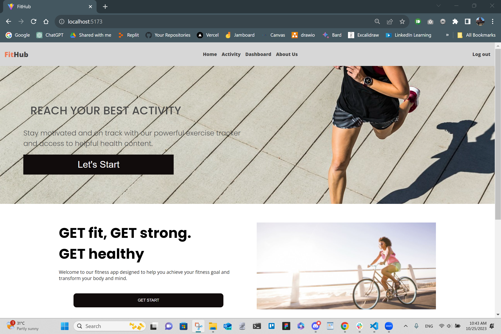
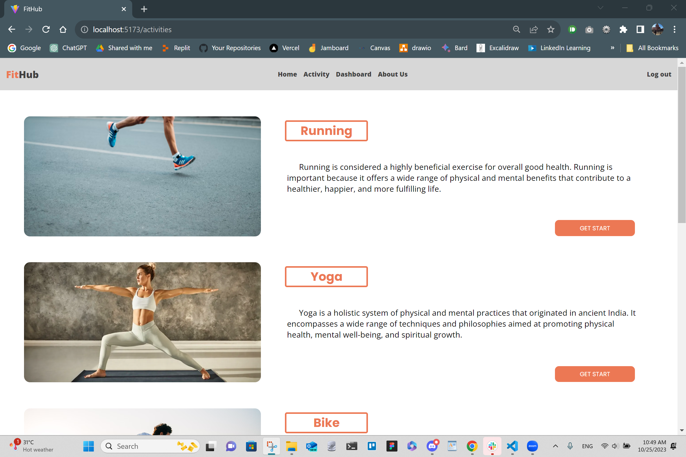

<a id="name-logo"></a>


[](https://npmjs.org/package/choo) [](https://nodejs.org/api/documentation.html#documentation_stability_index) [](https://standardjs.com) []()

<!-- Choose a self-explaining name for your project. -->

Welcome to FitHub, your ultimate fitness companion designed to transform your health and wellness journey into an exhilarating adventure! Whether you're a fitness enthusiast or just starting your fitness odyssey, FitHub is here to guide, motivate, and empower you every step of the way.

---

<!-- ## Table Of Content[](#table_of_content) -->

## Table Of Contents 🖇️

- [Introduction](#introduction)
- [Visuals](#visuals)
- [Installation](#installation)
- [Open Source](#open-source)
- [Contributors](#contributors)
- [Supportraisers](#supportraisers)

---

<a id="introduction"></a>

## Introduction 🚀

<!-- Let people know what your project can do specifically. Provide context and add a link to any reference visitors might be unfamiliar with. A list of Features or a Background subsection can also be added here. If there are alternatives to your project, this is a good place to list differentiating factors.   -->

**FitHub**: Your Passport to Fitness, Anytime, Anywhere

- Instant access, no logins—fitness at your fingertips.
- Run🏃, bike🚴, sculpt abs🧖‍♂️, swim🏊, or weight train🏋️ effortlessly.
- Intuitive dashboard for goal setting and progress tracking.
- Unique graphs for each activity, offering valuable insights.
- Your companion for embracing a healthier lifestyle, anytime, anywhere.

---

<!-- ## Badges[](#badges) -->

## Badges 🎀

<!-- On some READMEs, you may see small images that convey metadata, such as whether or not all the tests are passing for the project. You can use Shields to add some to your README. Many services also have instructions for adding a badge. -->


---

<a id="visuals"></a>

## Visuals 💻

<!-- Depending on what you are making, it can be a good idea to include screenshots or even a video (you'll frequently see GIFs rather than actual videos). Tools like ttygif can help, but check out Asciinema for a more sophisticated method. -->

#### Home page



<!--  -->

#### Activity page



#### Dashboard page


#### About Us page


#### How it works


<div align="right">[ <a href="#name-logo">↑ Back to top ↑</a> ]</div>

---

<a id="installation"></a>

## Installation 🤖

<!-- Within a particular ecosystem, there may be a common way of installing things, such as using Yarn, NuGet, or Homebrew. However, consider the possibility that whoever is reading your README is a novice and would like more guidance. Listing specific steps helps remove ambiguity and gets people to using your project as quickly as possible. If it only runs in a specific context like a particular programming language version or operating system or has dependencies that have to be installed manually, also add a Requirements subsection. -->

To obtain the source codes and the dependent modules, run the git-command in your `projects` folder:

1. Clone Frontend

```bash
git clone https://github.com/NathanMun/final-project-frontend.git
```

2. Clone Backend

```bash
git clone https://github.com/NathanMun/final-project-backend.git
```

3. Install package and dependencies

```bash
npm install
```

4. Project Run and Test

```bash
npm run dev
```

💬 &emsp; Ask us about anything [here](https://github.com/NathanMun/final-project-frontend/issues)

<div align="right">[ <a href="#name-logo">↑ Back to top ↑</a> ]</div>

---

<a id="open-source"></a>

## Open Source 📢

<!-- Tell people where they can go to for help. It can be any combination of an issue tracker, a chat room, an email address, etc. -->

[](https://github.com/NathanMun/final-project-frontend)

[](https://github.com/NathanMun/final-project-backend)

<div align="right">[ <a href="#name-logo">↑ Back to top ↑</a> ]</div>

---

<!-- ## Roadmap[](#roadmap) -->

## Roadmap 🛣️

<!-- If you have ideas for releases in the future, it is a good idea to list them in the README. -->

| **Scale** | **What to act**                                                                                                                                                                                                                                                                                                                                                                                    |
| :-------: | :------------------------------------------------------------------------------------------------------------------------------------------------------------------------------------------------------------------------------------------------------------------------------------------------------------------------------------------------------------------------------------------------- |
|   **S**   | Conclusively, our ultimate goal entails the integration of a ranking mechanism on a weekly and monthly basis, achieved by aggregating comprehensive data sourced from the dashboard. This innovation is set to provide an engaging dimension to our platform, fostering a sense of accomplishment and healthy competition among users.                                                             |
|   **M**   | Starting from a family setting, our aspiration is to gradually extend our reach to our professional colleagues and ultimately, the wider public. This strategic progression would enable me to venture into the commercial pattern with my web application and attract sponsorship opportunities.                                                                                                  |
|   **L**   | Subsequently, we intend to amplify its visibility through an incentive system. As a prime illustration, we plan to incorporate a rewards program featuring offerings such as discounted vouchers for sports equipment, coupons for nutrition products, and collaborations with vegan food establishments. This strategic approach is poised to elevate the widespread recognition of our platform. |

---

<a id="contributors"></a>

## Contributors 🦸

<!-- State if you are open to contributions and what your requirements are for accepting them.

For people who want to make changes to your project, it's helpful to have some documentation on how to get started. Perhaps there is a script that they should run or some environment variables that they need to set. Make these steps explicit. These instructions could also be useful to your future self.

You can also document commands to lint the code or run tests. These steps help to ensure high code quality and reduce the likelihood that the changes inadvertently break something. Having instructions for running tests is especially helpful if it requires external setup, such as starting a Selenium server for testing in a browser. -->

We'd like to thank the following people for their contributions to this project:

| [<br /><sub><b>Rattanun Rodchawang</b></sub>](https://github.com/rattanun00000) | [<br /><sub><b>Thanyalak Tanyianniti</b></sub>](https://github.com/ThanyalakTan) | [<br /><sub><b>Supachai Wansen</b></sub>](https://github.com/spchws) | [<br /><sub><b>Nuch-cha Boonyato</b></sub>](https://github.com/Pulsenuchcha) | [<br /><sub><b>Nathawut Munsri</b></sub>](https://github.com/NathanMun) |
| :---------------------------------------------------------------------------------------------------------------------------------------------: | :---------------------------------------------------------------------------------------------------------------------------------------------: | :---------------------------------------------------------------------------------------------------------------------------: | :-----------------------------------------------------------------------------------------------------------------------------------------: | :---------------------------------------------------------------------------------------------------------------------------------: |

<!-- ## Acknowledgment[](#author) -->

<a id="supportraisers"></a>

## Supportraisers 🙇‍♂️

<!-- Show your appreciation to those who have contributed to the project. -->

### 🌟 Heartfelt Thanks to Our Mentor and Encouragists, You Are Our Beacon of Inspiration! 👏👏

- **[Generation Thailand & Super Team](https://www.linkedin.com/company/generation-thailand/)**  
  | 😍 Our switching-career-path opener |
- **[Khun Kanin Kearpimy](https://www.linkedin.com/in/kanin-kearpimy-48a2b2165/)**  
  | 😍 Our tech head coach with super unique character who has been igniting a passion for technology in the hearts of learners. |
- **[Khun Kanthamas Iamrhod](https://www.linkedin.com/in/kanthamas/)**  
  | 😍 Our cheerful heartwarming career-switching role model who always brings peace and tranquility to the camp. |
- **[Khun Lak Donovan](https://www.linkedin.com/in/lak-donovan/)**  
  | 😍 Our cross-continental guardian who seems like a guiding star in the digital universe, offering direction and support to learners navigating the complexities of technology.|
- **[Khun Tanatsit Boonrattanabandit](https://www.linkedin.com/in/tanatsit/)**  
  | 😍 Our silent luminary who is a source of inspiration without words, shining brightly through actions. |
- **[Khun Thanapoj Sawatprawitgun](https://www.linkedin.com/in/thanapoj-sawatprawitgun-960b41266/)**  
  | 😍 Our empowering big-brother-like mentor illuminating the path to a new career, grooming us with knowledge and enthusiasm, and guiding toward success in the technology field. |

<div align="right">[ <a href="#name-logo">↑ Back to top ↑</a> ]</div>

---

<!-- ## License[](#license) -->

<!-- For open source projects, say how it is licensed. -->

<!-- ## Project Status[](#project_status) -->

<!-- If you have run out of energy or time for your project, put a note at the top of the README saying that development has slowed down or stopped completely. Someone may choose to fork your project or volunteer to step in as a maintainer or owner, allowing your project to keep going. You can also make an explicit request for maintainers. -->
